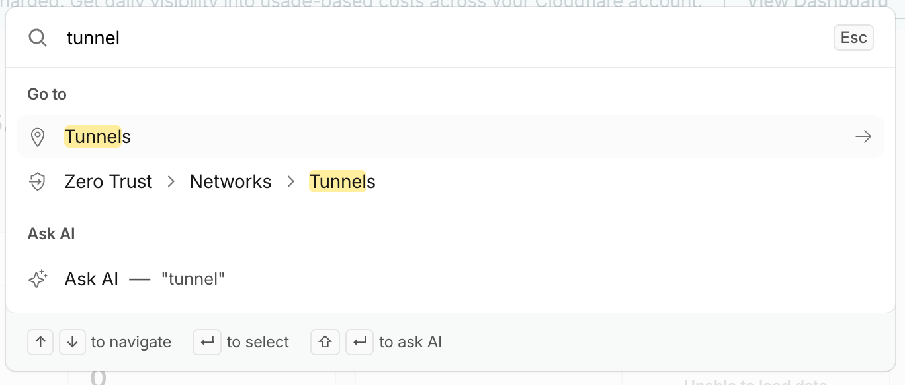
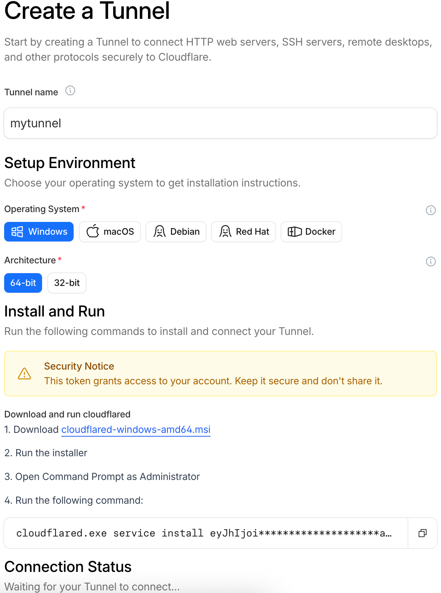
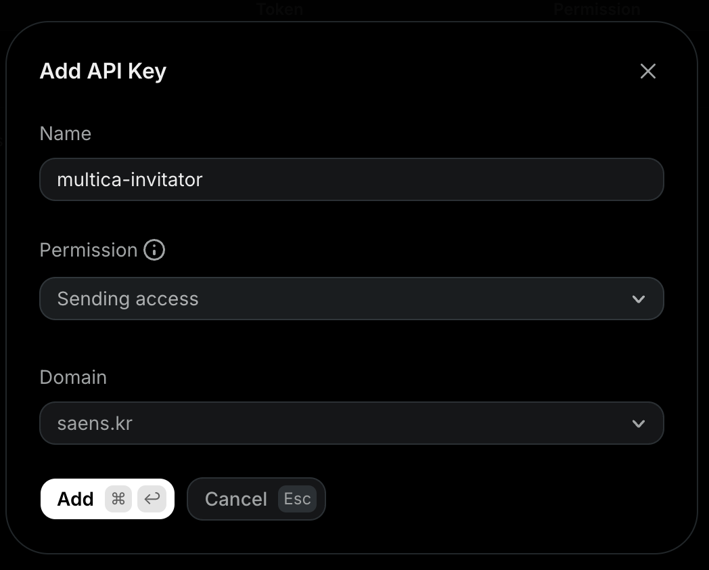

`https://multica.saens.kr`이라는 주소를 통해 언제 어디서든 multica에 접근하고, 이메일로 팀원들을 초대하여 쉽게 접근할 수 있도록 하고 싶었습니다.

## 1. Cloudflare DNS / Tunnel

주소(multica.saens.kr)를, multica가 구동되고 있는 `localhost:{포트번호}`로 향하도록 "터널링"이라는 작업을 수행해야 합니다.

### a. DNS 설정

먼저 Cloudflare에 가입해서 DNS 설정을 합니다. 제가 도메인(saens.kr)을 구입한 곳이 호스팅케이알인데, DNS 설정 주체를 Cloudflare로 바꿔야 합니다. 호스팅케이알에서 Cloudflare의 네임서버를 입력해줍니다.

이렇게 하면 호스팅케이알에서는 DNS 설정을 할 수 없게 되는데, 상관 없습니다. Cloudflare에서 더 많은 기능을 누릴 수 있거든요. (제미나이가 그렇다고 하네요)
호스팅케이알에 있던 모든 DNS 설정을 이쪽으로 자동으로 옮겨주는 기능이 있다고 했던 것 같긴 한데, 저는 그냥 수동으로 했습니다.

### b. 터널링

Cloudflare 대쉬보드에 들어가서, 왼쪽 상단의 검색창을 클릭하고 Tunnel을 검색하면, 그곳에서 `Create Tunnel` 버튼을 통해 터널을 만들 수 있습니다.

여기 나와있는대로 환경에 맞게 설정하면 됩니다. 저는 윈도우 서버를 사용하고 있습니다. 한글로 다시 적어보자면 다음과 같습니다.

1. .msi 파일 설치 후 실행
2. 관리자권한으로 명령창 (powershell이든 cmd든) 실행 후 `cloudflared.exe ...` 명령 입력

여기까지 잘 되면 가장 아래 `Connection Status`에 초록색으로 `Connected!`라고 뜹니다.

이후 다음으로 넘어가주면 접속할 주소의 이름(multica)과 도메인(saens.kr)을 입력해야 하는데, 도메인은 위 `a`에서 설정을 잘 마쳤다면 드롭다운에 보입니다.
그러고 연결될 target을 `localhost:{포트}` 로 지정해주면 터널링 끝!  

참고로 저는 tailscale을 쓰고 있어서 충돌이 없을까, tailscale주소로 해야하는 것 아닌가 걱정했는데, 그냥 localhost로 하면 됩니다.

이렇게 하고 좀 기다린(저는 20분 정도) 후 `multica.saens.kr`로 접속하면 multica 페이지로 연결이 될겁니다. multica가 `localhost:{포트}` 에서 잘 구동되고 있다면요!

## 2. Resend 설정

Resend는 이메일 API 서비스입니다. 프로그램으로 이메일을 보낼 수 있게 해줍니다. 즉 multica에서 사용자를 초대할 때 해당 사용자에게 이메일을 보내야 하는데, 이를 위해 Resend API를 사용하는 것이죠.

### a. DNS 설정

저는 일단 Github OAtuh로 가입해서 기본 이메일이 해당 이메일로 돼있는데, 저는 제 도메인(saens.kr)을 사용하고 싶었습니다. 좌측에 `Domain`으로 가줍니다. 도메인을 입력하면 Cloudflare에 자동으로 DNS 설정을 추가해주는 버튼이 생깁니다. 그거만 눌러주면 바로 DNS 설정은 끝!

### b. API 키 생성

좌측에 `API`로 갑니다. `Create` 버튼을 눌러 아래와 같이 `Sending Access` 권한만 부여해주고, 제 도메인을 선택해줍니다.

다음으로 가면 API 키를 복사할 수 있습니다. 이는 복사해두고 multica의 `.env`에 입력해야 하는데, 아래에서 다룹니다.

## 3. Google OAuth 설정

1. [Google Cloud]()에서 프로젝트 생성
2.

## 4. `.env` 설정
